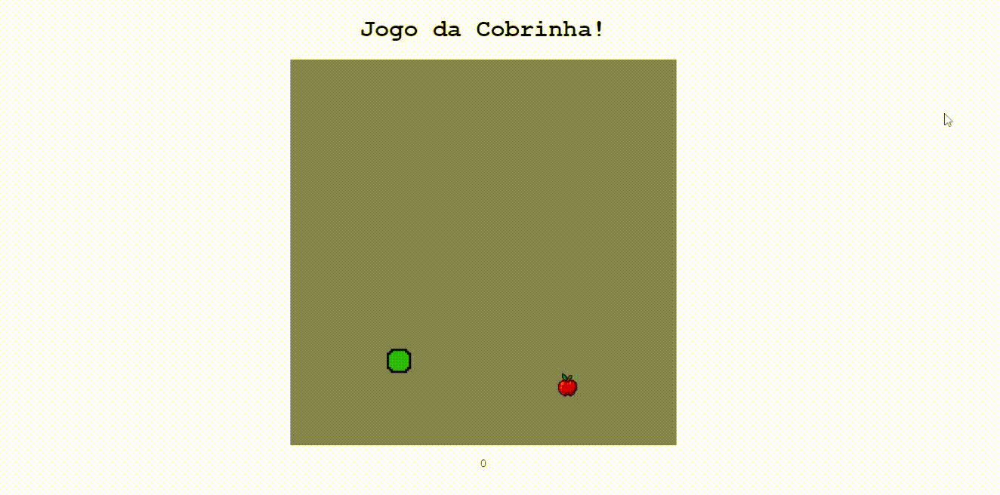

# Jogo da cobrinha (snake game) 🐍

> Recriando o jogo da cobrinha com HTML, CSS e JS.

O jogo da cobrinha é um jogo que ficou conhecido por diversas versões cuja versão inicial começou com o jogo Blockade de 1976, sendo feitas várias imitações em vídeo-games e computadores. No fim dos anos 90 foi popularizado em celulares da Nokia que vinham com o jogo já incluso. (Wikipédia)

- Para rodar, abra a index.html.

## Licença 📄
Distribuido sob a licença MIT License. Veja `LICENSE` para mais informações.
